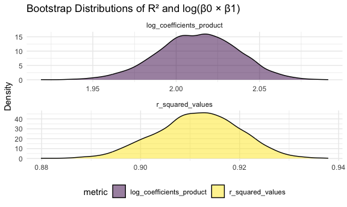

p8105_hw6_ys3766
================
Yifan Shi
2024-12-03

# Question 1

``` r
weather_df = 
  rnoaa::meteo_pull_monitors(
    c("USW00094728"),
    var = c("PRCP", "TMIN", "TMAX"), 
    date_min = "2017-01-01",
    date_max = "2017-12-31") %>%
  mutate(
    name = recode(id, USW00094728 = "CentralPark_NY"),
    tmin = tmin / 10,
    tmax = tmax / 10) %>%
  select(name, id, everything())
```

    ## using cached file: /Users/syf/Library/Caches/org.R-project.R/R/rnoaa/noaa_ghcnd/USW00094728.dly

    ## date created (size, mb): 2024-09-26 10:43:57.480854 (8.651)

    ## file min/max dates: 1869-01-01 / 2024-09-30

Generate 5000 bootstrap samples

``` r
set.seed(123)
bootstrap_samples <- modelr::bootstrap(weather_df, 5000)
```

Fit models and compute metrics for each bootstrap sample

``` r
bootstrap_analysis <- bootstrap_samples %>%
  mutate(
    linear_model = map(strap, ~ lm(tmax ~ tmin, data = as_tibble(.x))),
    r_squared_values = map_dbl(linear_model, function(model) glance(model)[["r.squared"]]),
    log_coefficients_product = map_dbl(linear_model, function(model) {
      coefficients <- tidy(model) %>% pull(estimate)
      log(coefficients[1] * coefficients[2])
    })
  ) %>%
  select(r_squared_values, log_coefficients_product)
```

Plot distributions of r-squared and log(beta0 \* beta1)

``` r
bootstrap_analysis %>%
  pivot_longer(cols = everything(), names_to = "metric", values_to = "value") %>%
  ggplot(aes(x = value, fill = metric)) +
  geom_density(alpha = 0.5) +
  facet_wrap(vars(metric), scales = "free", ncol = 1) +
  labs(
    title = "Bootstrap Distributions of R² and log(β0 × β1)",
    x = NULL,
    y = "Density"
  )
```



The upper plot of log(beta0 x beta1) is symmetrically distributed,
centered around 2.00, with values ranging from 1.95 to 2.05. This shows
moderate variability in the regression coefficients across samples, but
supports the stability of the model parameters and a good over all fit.

The lower plot of R^2 shows a symmetric distribution concentrating
between 0.88 and 0.93, with a peak at around 0.91. This indicates a
consistently strong model fit across the bootstrap samples, with low
variability, suggesting the model reliably explains the variance in tmax
using tmin.

95% CI

``` r
bootstrap_analysis %>%
  summarise(
    r_squared_lower = quantile(r_squared_values, 0.025),
    r_squared_upper = quantile(r_squared_values, 0.975),
    log_coefficients_product_lower = quantile(log_coefficients_product, 0.025),
    log_coefficients_product_upper = quantile(log_coefficients_product, 0.975)
  ) %>% knitr::kable(digits = 3)
```

| r_squared_lower | r_squared_upper | log_coefficients_product_lower | log_coefficients_product_upper |
|----------------:|----------------:|-------------------------------:|-------------------------------:|
|           0.895 |           0.927 |                          1.964 |                          2.058 |
