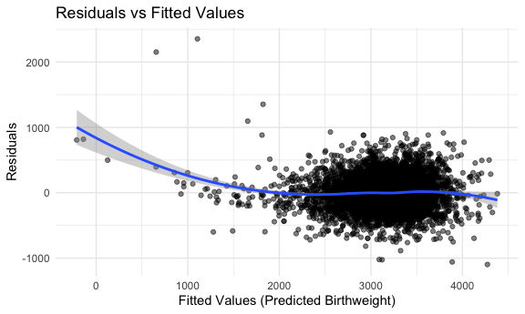
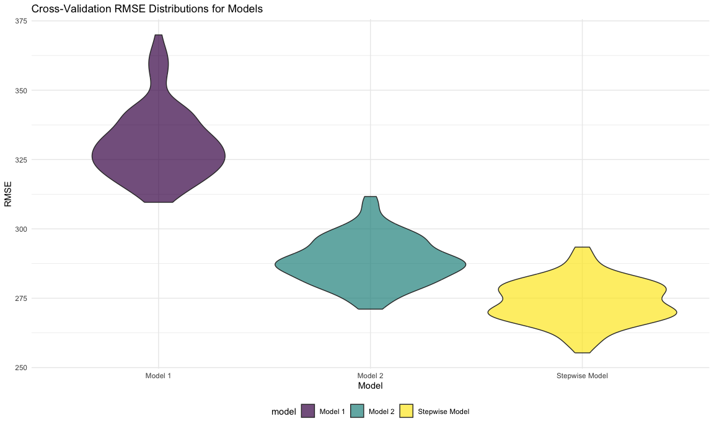

p8105_hw6_ys3766
================
Yifan Shi
2024-12-03

# Question 1

``` r
weather_df = 
  rnoaa::meteo_pull_monitors(
    c("USW00094728"),
    var = c("PRCP", "TMIN", "TMAX"), 
    date_min = "2017-01-01",
    date_max = "2017-12-31") %>%
  mutate(
    name = recode(id, USW00094728 = "CentralPark_NY"),
    tmin = tmin / 10,
    tmax = tmax / 10) %>%
  select(name, id, everything())
```

    ## using cached file: /Users/syf/Library/Caches/org.R-project.R/R/rnoaa/noaa_ghcnd/USW00094728.dly

    ## date created (size, mb): 2024-09-26 10:43:57.480854 (8.651)

    ## file min/max dates: 1869-01-01 / 2024-09-30

Generate 5000 bootstrap samples

``` r
set.seed(123)
bootstrap_samples <- modelr::bootstrap(weather_df, 5000)
```

Fit models and compute metrics for each bootstrap sample

``` r
bootstrap_analysis <- bootstrap_samples %>%
  mutate(
    linear_model = map(strap, ~ lm(tmax ~ tmin, data = as_tibble(.x))),
    r_squared_values = map_dbl(linear_model, function(model) glance(model)[["r.squared"]]),
    log_coefficients_product = map_dbl(linear_model, function(model) {
      coefficients <- tidy(model) %>% pull(estimate)
      log(coefficients[1] * coefficients[2])
    })
  ) %>%
  select(r_squared_values, log_coefficients_product)
```

Plot distributions of r-squared and log(beta0 \* beta1)

``` r
bootstrap_analysis %>%
  pivot_longer(cols = everything(), names_to = "metric", values_to = "value") %>%
  ggplot(aes(x = value, fill = metric)) +
  geom_density(alpha = 0.5) +
  facet_wrap(vars(metric), scales = "free", ncol = 1) +
  labs(
    title = "Bootstrap Distributions of R² and log(β0 × β1)",
    x = NULL,
    y = "Density"
  )
```


The upper plot of log(beta0 x beta1) is symmetrically distributed,
centered slightly above 2.00, with values ranging from 1.95 to 2.05.
This shows moderate variability in the regression coefficients across
samples, but supports the stability of the model parameters and a good
over all fit.

The lower plot of R^2 shows a symmetric distribution concentrating
between 0.88 and 0.93, with a peak at around 0.91. This indicates a
consistently strong model fit across the bootstrap samples, with low
variability, suggesting the model reliably explains the variance in tmax
using tmin.

95% CI

``` r
bootstrap_analysis %>%
  summarise(
    r_squared_lower = quantile(r_squared_values, 0.025),
    r_squared_upper = quantile(r_squared_values, 0.975),
    log_coefficients_product_lower = quantile(log_coefficients_product, 0.025),
    log_coefficients_product_upper = quantile(log_coefficients_product, 0.975)
  ) %>% knitr::kable(digits = 3)
```

| r_squared_lower | r_squared_upper | log_coefficients_product_lower | log_coefficients_product_upper |
|----------------:|----------------:|-------------------------------:|-------------------------------:|
|           0.895 |           0.927 |                          1.964 |                          2.058 |

# Question 2

import data, clean and prepare for analysi

``` r
homicide_df <- read_csv(file = "data/homicide-data.csv", na = c("Unknown", "NA", "")) %>%
  mutate(
    city_state = str_c(city, state, sep = ", "),
    solved = if_else(disposition == "Closed by arrest", 1, 0),
    victim_age = as.numeric(victim_age),
    reported_date = as.Date(as.character(reported_date), format = "%Y%m%d"),
  ) %>%
  filter(
    !city_state %in% c("Dallas, TX", "Phoenix, AZ", "Kansas City, MO", "Tulsa, AL"),
    victim_race %in% c("White", "Black")
  )
```

    ## Rows: 52179 Columns: 12
    ## ── Column specification ────────────────────────────────────────────────────────
    ## Delimiter: ","
    ## chr (8): uid, victim_last, victim_first, victim_race, victim_sex, city, stat...
    ## dbl (4): reported_date, victim_age, lat, lon
    ## 
    ## ℹ Use `spec()` to retrieve the full column specification for this data.
    ## ℹ Specify the column types or set `show_col_types = FALSE` to quiet this message.

Logistic Regression for Baltimore, MD

``` r
baltimore_results <- homicide_df %>%
  filter(city_state == "Baltimore, MD") %>%
  glm(solved ~ victim_age + victim_sex + victim_race, family = binomial(), data = .) %>%
  broom::tidy(conf.int = TRUE) %>%
  filter(term == "victim_sexMale") %>%
  mutate(
    OR = exp(estimate),       
    CI_lower = exp(conf.low),   
    CI_upper = exp(conf.high)  
  ) %>%
  select(OR, CI_lower, CI_upper)

knitr::kable(baltimore_results, digits = 3, caption = "Adjusted OR for Male vs Female Victims in Baltimore, MD")
```

|    OR | CI_lower | CI_upper |
|------:|---------:|---------:|
| 0.426 |    0.324 |    0.558 |

Adjusted OR for Male vs Female Victims in Baltimore, MD

Logistic Regression for Each City

``` r
city_results <- homicide_df %>%
  group_by(city_state) %>%
  nest() %>%
  mutate(
    model = map(data, ~ glm(solved ~ victim_age + victim_sex + victim_race, family = binomial(), data = .x)),
    results = map(model, ~ broom::tidy(.x, conf.int = TRUE) %>%
                    filter(term == "victim_sexMale") %>%
                    mutate(
                      OR = exp(estimate),
                      ci_lower = exp(conf.low),
                      ci_upper = exp(conf.high)
                    ) %>%
                    select(OR, ci_lower, ci_upper))
  ) %>%
  unnest(results) %>%
  select(city_state, OR, ci_lower, ci_upper)

knitr::kable(city_results, digits = 3, caption = "Adjusted ORs for Male vs Female Victims Across Cities")
```

| city_state         |    OR | ci_lower | ci_upper |
|:-------------------|------:|---------:|---------:|
| Albuquerque, NM    | 1.767 |    0.825 |    3.762 |
| Atlanta, GA        | 1.000 |    0.680 |    1.458 |
| Baltimore, MD      | 0.426 |    0.324 |    0.558 |
| Baton Rouge, LA    | 0.381 |    0.204 |    0.684 |
| Birmingham, AL     | 0.870 |    0.571 |    1.314 |
| Boston, MA         | 0.667 |    0.351 |    1.260 |
| Buffalo, NY        | 0.521 |    0.288 |    0.936 |
| Charlotte, NC      | 0.884 |    0.551 |    1.391 |
| Chicago, IL        | 0.410 |    0.336 |    0.501 |
| Cincinnati, OH     | 0.400 |    0.231 |    0.667 |
| Columbus, OH       | 0.532 |    0.377 |    0.748 |
| Denver, CO         | 0.479 |    0.233 |    0.962 |
| Detroit, MI        | 0.582 |    0.462 |    0.734 |
| Durham, NC         | 0.812 |    0.382 |    1.658 |
| Fort Worth, TX     | 0.669 |    0.394 |    1.121 |
| Fresno, CA         | 1.335 |    0.567 |    3.048 |
| Houston, TX        | 0.711 |    0.557 |    0.906 |
| Indianapolis, IN   | 0.919 |    0.678 |    1.241 |
| Jacksonville, FL   | 0.720 |    0.536 |    0.965 |
| Las Vegas, NV      | 0.837 |    0.606 |    1.151 |
| Long Beach, CA     | 0.410 |    0.143 |    1.024 |
| Los Angeles, CA    | 0.662 |    0.457 |    0.954 |
| Louisville, KY     | 0.491 |    0.301 |    0.784 |
| Memphis, TN        | 0.723 |    0.526 |    0.984 |
| Miami, FL          | 0.515 |    0.304 |    0.873 |
| Milwaukee, wI      | 0.727 |    0.495 |    1.054 |
| Minneapolis, MN    | 0.947 |    0.476 |    1.881 |
| Nashville, TN      | 1.034 |    0.681 |    1.556 |
| New Orleans, LA    | 0.585 |    0.422 |    0.812 |
| New York, NY       | 0.262 |    0.133 |    0.485 |
| Oakland, CA        | 0.563 |    0.364 |    0.867 |
| Oklahoma City, OK  | 0.974 |    0.623 |    1.520 |
| Omaha, NE          | 0.382 |    0.199 |    0.711 |
| Philadelphia, PA   | 0.496 |    0.376 |    0.650 |
| Pittsburgh, PA     | 0.431 |    0.263 |    0.696 |
| Richmond, VA       | 1.006 |    0.483 |    1.994 |
| San Antonio, TX    | 0.705 |    0.393 |    1.238 |
| Sacramento, CA     | 0.669 |    0.326 |    1.314 |
| Savannah, GA       | 0.867 |    0.419 |    1.780 |
| San Bernardino, CA | 0.500 |    0.166 |    1.462 |
| San Diego, CA      | 0.413 |    0.191 |    0.830 |
| San Francisco, CA  | 0.608 |    0.312 |    1.155 |
| St. Louis, MO      | 0.703 |    0.530 |    0.932 |
| Stockton, CA       | 1.352 |    0.626 |    2.994 |
| Tampa, FL          | 0.808 |    0.340 |    1.860 |
| Tulsa, OK          | 0.976 |    0.609 |    1.544 |
| Washington, DC     | 0.691 |    0.466 |    1.014 |

Adjusted ORs for Male vs Female Victims Across Cities

Plot Adjusted Odds Ratios and Confidence Intervals

``` r
city_results %>%
  ggplot(aes(x = reorder(city_state, OR), y = OR)) +
  geom_point() +
  geom_errorbar(aes(ymin = ci_lower, ymax = ci_upper), width = 0.2) +
  coord_flip() +
  labs(
    title = "Estimated ORs for Male vs Female Victims Across Cities",
    x = "City, State",
    y = "Odds Ratio (Male vs Female Victims)"
  )
```


The plot shows adjusted odds ratios (ORs) for solving homicides
involving male vs. female victims across cities, with 95% confidence
intervals (CIs). ORs \> 1 suggest male homicides are more likely solved,
while ORs \< 1 indicate the opposite. Many cities cluster around an OR
of 1, showing no significant gender-based differences, as their CIs
overlap 1. Cities like New York, NY, and Chicago, IL, have narrow CIs,
reflecting precise estimates due to larger sample sizes, whereas cities
like Albuquerque, NM, Stockton, CA, and Fresno, CA, have wide CIs,
reflecting high uncertainty due to smaller samples or variability. While
most cities show no significant gender bias, the variability in cities
with extreme ORs or wide CIs, such as Albuquerque, NM, and Stockton, CA,
warrants further investigation.

# Question 3

Load and clean the dataset

``` r
birthweight_df <- read_csv("data/birthweight.csv") %>%
  janitor::clean_names() %>%  
  mutate(
    babysex = factor(babysex, levels = c(1, 2), labels = c("male", "female")),
    frace = factor(frace, levels = c(1, 2, 3, 4, 8, 9), 
                   labels = c("White", "Black", "Asian", "Puerto Rican", "Other", "Unknown")),
    mrace = factor(mrace, levels = c(1, 2, 3, 4, 8), 
                   labels = c("White", "Black", "Asian", "Puerto Rican", "Other")),
    malform = as.logical(malform)  
  ) %>%
  drop_na()
```

    ## Rows: 4342 Columns: 20
    ## ── Column specification ────────────────────────────────────────────────────────
    ## Delimiter: ","
    ## dbl (20): babysex, bhead, blength, bwt, delwt, fincome, frace, gaweeks, malf...
    ## 
    ## ℹ Use `spec()` to retrieve the full column specification for this data.
    ## ℹ Specify the column types or set `show_col_types = FALSE` to quiet this message.

Regression model

``` r
full_model <- lm(
  bwt ~ babysex + bhead + blength + delwt + fincome + frace + gaweeks +
    malform + menarche + mheight + momage + mrace + parity +
    pnumlbw + pnumsga + ppbmi + ppwt + smoken + wtgain,
  data = birthweight_df
)

# Backward elimination
stepwise_model <- step(full_model, direction = "backward", trace = 0)

summary(stepwise_model)
```

    ## 
    ## Call:
    ## lm(formula = bwt ~ babysex + bhead + blength + delwt + fincome + 
    ##     gaweeks + mheight + mrace + parity + ppwt + smoken, data = birthweight_df)
    ## 
    ## Residuals:
    ##      Min       1Q   Median       3Q      Max 
    ## -1097.18  -185.52    -3.39   174.14  2353.44 
    ## 
    ## Coefficients:
    ##                     Estimate Std. Error t value Pr(>|t|)    
    ## (Intercept)       -6098.8219   137.5463 -44.340  < 2e-16 ***
    ## babysexfemale        28.5580     8.4549   3.378 0.000737 ***
    ## bhead               130.7770     3.4466  37.944  < 2e-16 ***
    ## blength              74.9471     2.0190  37.120  < 2e-16 ***
    ## delwt                 4.1067     0.3921  10.475  < 2e-16 ***
    ## fincome               0.3180     0.1747   1.820 0.068844 .  
    ## gaweeks              11.5925     1.4621   7.929 2.79e-15 ***
    ## mheight               6.5940     1.7849   3.694 0.000223 ***
    ## mraceBlack         -138.7925     9.9071 -14.009  < 2e-16 ***
    ## mraceAsian          -74.8868    42.3146  -1.770 0.076837 .  
    ## mracePuerto Rican  -100.6781    19.3247  -5.210 1.98e-07 ***
    ## parity               96.3047    40.3362   2.388 0.017004 *  
    ## ppwt                 -2.6756     0.4274  -6.261 4.20e-10 ***
    ## smoken               -4.8434     0.5856  -8.271  < 2e-16 ***
    ## ---
    ## Signif. codes:  0 '***' 0.001 '**' 0.01 '*' 0.05 '.' 0.1 ' ' 1
    ## 
    ## Residual standard error: 272.3 on 4328 degrees of freedom
    ## Multiple R-squared:  0.7181, Adjusted R-squared:  0.7173 
    ## F-statistic: 848.1 on 13 and 4328 DF,  p-value: < 2.2e-16

Residual Analysis

``` r
birthweight_df <- birthweight_df %>%
  mutate(
    predicted_bwt = predict(stepwise_model, newdata = .),
    residuals_bwt = residuals(stepwise_model)
  )

ggplot(birthweight_df, aes(x = predicted_bwt, y = residuals_bwt)) +
  geom_point(alpha = 0.5) +
  geom_smooth(method = "loess") +
  labs(
    title = "Residuals vs Fitted Values",
    x = "Fitted Values (Predicted Birthweight)",
    y = "Residuals"
  ) +
  theme_minimal()
```

    ## `geom_smooth()` using formula = 'y ~ x'



To predict birthweight, the proposed model incorporates a combination of
baby characteristics, maternal factors, and pregnancy-specific
variables. This comprehensive approach reflects the biological and
socioeconomic factors influencing fetal growth. Key predictors include
baby sex, head circumference, and length at birth, which directly
capture physical growth. Maternal characteristics such as weight at
delivery, height, and smoking behavior are included as they
significantly affect maternal and fetal health. Socioeconomic variables
like family income and race provide proxies for healthcare access and
resources. Finally, pregnancy-specific predictors like gestational age,
parity, and weight gain during pregnancy address the broader context of
fetal development. After applying backward elimination to refine the
model, the adjusted model achieved an R^2 of approximately 0.72,
indicating a strong fit to the data. Residual diagnostics showed no
major deviations from linear regression assumptions.

The residuals vs. fitted values plot shows that residuals are centered
around zero, indicating no systematic bias in the predictions. However,
a slight curvature at lower fitted values suggests potential
non-linearity that could be better addressed with alternative modeling
techniques, such as non-linear regression or interaction terms. Despite
this, the overall distribution of residuals supports the validity of the
linear model for predicting birthweight.

cross validation

``` r
model_1 <- lm(bwt ~ blength + gaweeks, data = birthweight_df)
model_2 <- lm(bwt ~ bhead * blength * babysex, data = birthweight_df)

set.seed(123)
cv_results <- crossv_mc(birthweight_df, 100) %>%
  mutate(
    train = map(train, as_tibble),
    test = map(test, as_tibble),
    model_1 = map(train, ~ lm(bwt ~ blength + gaweeks, data = .x)),
    model_2 = map(train, ~ lm(bwt ~ bhead * blength * babysex, data = .x)),
    stepwise_model = map(train, ~ lm(
      bwt ~ babysex + bhead + blength + delwt + fincome + frace +
        gaweeks + malform + menarche + mheight + momage + mrace +
        parity + pnumlbw + pnumsga + ppbmi + ppwt + smoken + wtgain,
      data = .x
    ))
  ) %>%
  mutate(
    rmse_1 = map2_dbl(model_1, test, ~ rmse(.x, .y)),
    rmse_2 = map2_dbl(model_2, test, ~ rmse(.x, .y)),
    rmse_stepwise = map2_dbl(stepwise_model, test, ~ rmse(.x, .y))
  )

cv_summary <- cv_results %>%
  select(rmse_1, rmse_2, rmse_stepwise) %>%
  pivot_longer(cols = everything(), names_to = "model", values_to = "rmse") %>%
  mutate(model = recode(model,
                        "rmse_1" = "Model 1: Length + Gestational Age",
                        "rmse_2" = "Model 2: Head Circumference + Length + Sex",
                        "rmse_stepwise" = "Stepwise Model")) %>%
  group_by(model) %>%
  summarize(mean_rmse = mean(rmse), sd_rmse = sd(rmse))

cv_summary %>% knitr::kable(digits = 3, caption = "Cross-Validation RMSE Summary")
```

| model                                      | mean_rmse | sd_rmse |
|:-------------------------------------------|----------:|--------:|
| Model 1: Length + Gestational Age          |   330.709 |  12.633 |
| Model 2: Head Circumference + Length + Sex |   288.385 |   8.244 |
| Stepwise Model                             |   273.739 |   7.624 |

Cross-Validation RMSE Summary

Three models were compared to assess predictive performance using Monte
Carlo cross-validation with 100 iterations:

Model 1 (Length at Birth + Gestational Age): This simplest model showed
the poorest predictive performance, as indicated by its high root mean
squared error (RMSE) and wide variability. It lacks sufficient
predictors to capture the complex relationships influencing birthweight.

Model 2 (Head Circumference + Length + Sex with Interactions): This
intermediate model significantly outperformed Model 1. By including head
circumference, sex, and their interactions, it achieved better accuracy
with lower RMSE and less variability. It balances simplicity and
predictive power.

Stepwise Model (Full Model): The stepwise regression model exhibited the
lowest RMSE and most consistent predictions across iterations,
reflecting its ability to incorporate the multifactorial influences on
birthweight. However, the added complexity of this model may limit
interpretability in practical applications.

Violin plot

``` r
cv_results %>%
  select(rmse_1, rmse_2, rmse_stepwise) %>%
  pivot_longer(cols = everything(), names_to = "model", values_to = "rmse") %>%
  mutate(model = recode(model,
                        "rmse_1" = "Model 1",
                        "rmse_2" = "Model 2",
                        "rmse_stepwise" = "Stepwise Model")) %>%
  ggplot(aes(x = model, y = rmse, fill = model)) +
  geom_violin(alpha = 0.7) +
  labs(
    title = "Cross-Validation RMSE Distributions for Models",
    x = "Model",
    y = "RMSE"
  ) 
```



The violin plot of RMSE distributions clearly shows that the stepwise
model achieves the best predictive performance, while Model 2 offers a
more interpretable alternative with slightly lower predictive power.
Model 1 is insufficient for accurate predictions, highlighting the
importance of including a broader range of predictors.

The stepwise regression model is the most accurate for predicting
birthweight, making it ideal for applications requiring precision, such
as research studies or clinical decision-making. However, its complexity
may limit its use in settings where interpretability is critical. Model
2 provides a strong alternative, offering a balance between simplicity
and accuracy, making it suitable for public health or policy
applications. Ultimately, the choice of model depends on the specific
context and the need to balance interpretability, complexity, and
predictive performance.
